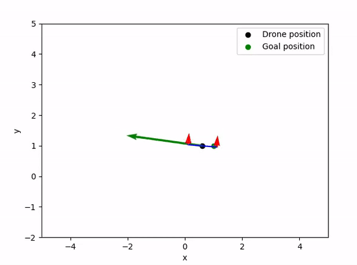

# PyBotSim

A simple python simulator for mobile robotics

## TODO
- Adjust structure of code to be OOP
- add drone 3-D model and controller
- Add MPC
- Add noise in model
- Add disturbances to drone

